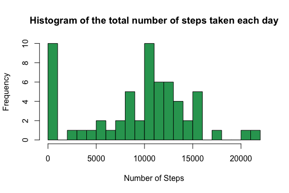
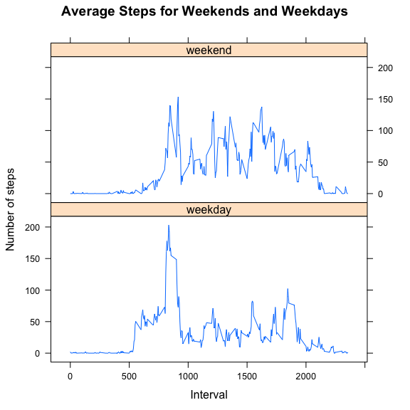

# Reproducible Research: Peer Assessment 1


## Loading and preprocessing the data

```r
## Read in data
data = read.csv("activity.csv", stringsAsFactors= FALSE)
str(data)
```

```
## 'data.frame':	17568 obs. of  3 variables:
##  $ steps   : int  NA NA NA NA NA NA NA NA NA NA ...
##  $ date    : chr  "2012-10-01" "2012-10-01" "2012-10-01" "2012-10-01" ...
##  $ interval: int  0 5 10 15 20 25 30 35 40 45 ...
```


## What is mean total number of steps taken per day?

```r
## tapply to get sum of steps for each date
steps_perday = tapply(data$steps, data$date, sum, na.rm=T)

## plot the histogram
hist(steps_perday, breaks=25,  col="#2ca25f",
     xlab = "Number of Steps",
     main= "Histogram of the total number of steps taken each day")
```




```r
## Print the mean
mean(steps_perday)
```

```
## [1] 9354.23
```

```r
## Print the median
median(steps_perday)
```

```
## [1] 10395
```

> The mean and median are 9354.23 and 10395, respectively. 

## What is the average daily activity pattern?


```r
## Calculate average steps per interval
steps_perint = tapply(data$steps, data$interval, mean, na.rm=T)

## Convert interval to time 
time = unique(data$interval)
time = as.POSIXct(strptime(paste(time %/% 100, time %% 100, sep=" "), format = "%H %M"))

## Plot average steps vs. time
plot(steps_perint ~ time, type="l",
     xlab = "Time", ylab = "Average Steps",
     main = "Average Steps for Each 5-minute Interval")
```


```r
## Print the time have maximum number of steps
format(time[which.max(steps_perint)], "%H:%M")
```

```
## [1] "08:35"
```

```r
print(max(steps_perint))
```

```
## [1] 206.1698
```

> The time is 8:35 (to 8:40) contains the maximum nubmer of steps 206.1698.

## Imputing missing values


```r
## 1 Total number of missing values
sum(is.na(data$steps))
```

```
## [1] 2304
```

> There are 2304 rows of data missing.

> Here I use the mean steps of that day to fill the missing data.


```r
## create new data set as data2 with missing values are filled with average of each day
data2 = data
for (i in 1:nrow(data2)){
  if (is.na(data$steps[i])){
    data2$steps[i] = steps_perday[data$date[i]]  
  }
}
```


```r
## tapply to get sum of steps for each date
steps_perday2 = tapply(data2$steps, data2$date, sum, na.rm=T)

## plot the histogram
hist(steps_perday2, breaks=25,  col="#2ca25f",
     xlab = "Number of Steps",
     main= "Histogram of the total number of steps taken each day in New dataset")
```


```r
## Print the mean
mean(steps_perday2)
```

```
## [1] 9354.23
```

```r
## Print the median
median(steps_perday2)
```

```
## [1] 10395
```

> The mean and median are the same as first part since I use the mean of each day to fill the missing data. So the mean and median keep the same. 


## Are there differences in activity patterns between weekdays and weekends?


```r
## New column as weekday or weekend
data2$date <- as.Date(data2$date, format = "%Y-%m-%d")
data2$weekday <- c("weekday")
data2$weekday[weekdays(data2$date) %in% c("Saturday","Sunday")] <- c("weekend")
data2$weekday <- as.factor(data2$weekday)
```


```r
## subset data into weekday and weekend
dataweekday <- subset(data2, weekday == "weekday")
dataweekend <- subset(data2, weekday == "weekend")

## calculate the average steps for eact interval for weekday and weekend
weekday_perint <- data.frame(time = unique(data$interval), avgsteps = tapply(dataweekday$steps, dataweekday$interval, mean, na.rm=T), week = rep("weekday", length = length(time)))
weekend_perint <- data.frame(time = unique(data$interval), avgsteps = tapply(dataweekend$steps, dataweekend$interval, mean, na.rm=T), week = rep("weekend", length = length(time)))
weekperint <- rbind(weekday_perint, weekend_perint)

## Plot figure
library(lattice)
xyplot(avgsteps ~ time | week, data = weekperint, layout = c(1, 2), 
       type = "l", ylab = "Number of steps", xlab = "Interval",
       main = "Average Steps for Weekends and Weekdays")
```



> From the figure above, we can see that more steps in weekdays than weekends at the early time of the day (5:00 to 10:00).  And less steps in weekdays than weekends from 10:00 to 17:00.  The later time of time is hard to compare.

